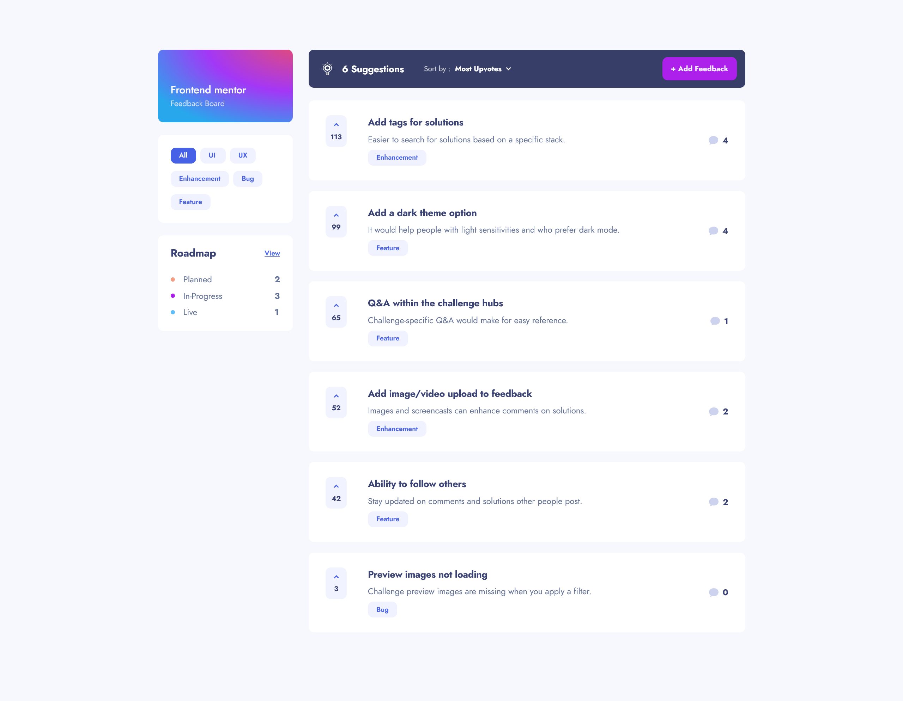

# Frontend Mentor - Product feedback app solution

This is a solution to the [Product feedback app challenge on Frontend Mentor](https://www.frontendmentor.io/challenges/product-feedback-app-wbvUYqjR6). Frontend Mentor challenges help you improve your coding skills by building realistic projects.

## Table of contents

- [Overview](#overview)
  - [The challenge](#the-challenge)
  - [Screenshot](#screenshot)
  - [Links](#links)
- [My process](#my-process)
  - [Built with](#built-with)
  - [What I learned](#what-i-learned)
  - [Continued development](#continued-development)
  - [Useful resources](#useful-resources)
- [Author](#author)
- [Acknowledgments](#acknowledgments)

## Overview

### The challenge

Users should be able to:

- View the optimal layout for the app depending on their device's screen size
- See hover states for all interactive elements on the page
- Create, read, update, and delete product feedback requests
- Receive form validations when trying to create/edit feedback requests
- Sort suggestions by most/least upvotes and most/least comments
- Filter suggestions by category
- Add comments and replies to a product feedback request
- Upvote product feedback requests
- **Bonus**: Keep track of any changes, even after refreshing the browser

### Screenshot

### Links

- Solution URL: [Add solution URL here](https://www.frontendmentor.io/solutions/fullstack-product-feedback-app-next14-prisma-with-a11y-in-mind-riGtkFsfIh)
- Live Site URL: [Add live site URL here](https://product-feedback-steel.vercel.app/)

## My process

### Built with

- Semantic HTML5 markup
- CSS custom properties
- Flexbox
- CSS Grid
- Desktop-first workflow
- [Typescript](https://www.typescriptlang.org/)
- [React](https://reactjs.org/) - JS library
- [Next.js](https://nextjs.org/) - React framework
- [CSS modules](https://github.com/css-modules/css-modules) - For styles
- [Prisma](https://www.prisma.io/)
- [MongoDB](https://www.mongodb.com/)
- [Zod](https://zod.dev/) - For form validation
- [Framer Motion](https://www.framer.com/motion/) - For easy spring and layout animations

### What I learned

In this project I’ve created a select component using combobox accessibility pattern. Although with some caveats, since my implementation relies heavily on aria-activedescendant to announce currently ‘active’ option to screen-readers, while not changing the tab focused element, there might be some limitation when it comes down to some combinations of screen readers and Safari.

I also implemented a tabs component in the mobile version of the Roadmap page. It uses [roving tabindex](https://www.stefanjudis.com/today-i-learned/roving-tabindex/).

This was my first time building a full-stack application. I chose Prisma due to its simplicity, type safety, and popularity. However, I did encounter some quirks using it with MongoDB. For example, cascade deletion of comments and their replies wasn't possible. To address this, I had to implement an additional step to convert each reply into a regular comment before deletion.

### Useful resources

- [Building accessible Select component in React](https://medium.com/lego-engineering/building-accessible-select-component-in-react-b61dbdf5122f)
- [Combobox Pattern - APG](https://www.w3.org/WAI/ARIA/apg/patterns/combobox/) - Two articles above helped me tremendously with understanding different aria-attributes that were required for accessible select component
- [Tabs Pattern - APG](https://www.w3.org/WAI/ARIA/apg/patterns/tabs/) - The tabs component is a lot more straightforward, still APG were an excellent resource

## Author

- Frontend Mentor - [@Akherousin](https://www.frontendmentor.io/profile/Akherousin)
